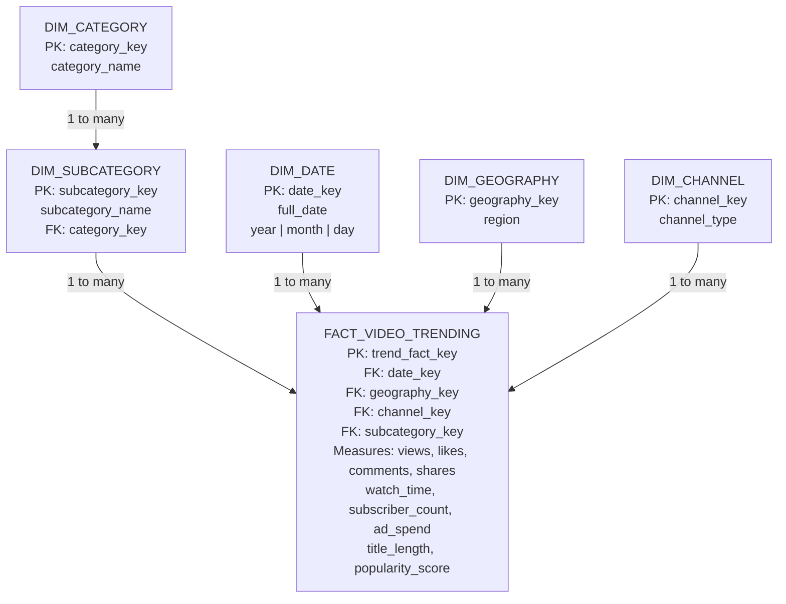

# YouTube Trending Content Analytics & Popularity Prediction

An end-to-end data analytics project that ingests YouTube Trending data, cleans and transforms it using Python, loads it into a **Snowflake Schema**, performs OLAP analysis, and trains a machine learning model to predict video popularity.

## Project Overview

This project demonstrates a complete **Data Warehousing and Data Mining workflow** using YouTube trending content. The pipeline covers data preparation, ETL, dimensional warehouse loading, SQL analytics, machine learning, and visualization.

## Snowflake Schema



### Why Snowflake Schema?

The model uses a normalized category hierarchy:

**FACT_VIDEO_TRENDING → DIM_SUBCATEGORY → DIM_CATEGORY**

Unlike a Star Schema where all dimensions connect directly to the fact table, the subcategory dimension is normalized through the category dimension. This creates the characteristic **Snowflake Schema** structure.

## Key Features

- End-to-end ETL pipeline: data ingestion → cleaning → Snowflake loading
- Normalized Snowflake Schema for analytical querying
- OLAP analysis using SQL
- Category, region, channel, and time-based analysis
- Machine learning model for popularity prediction
- Visualization of analytical results
- Engagement metrics excluded from ML features to reduce target leakage

## Project Structure

```text
youtube_trending_analytics_project/
├── data/
│   ├── raw/                    Raw YouTube Trending CSV
│   └── processed/              Cleaned data, dimensions, and fact table
├── sql/
│   ├── 01_warehouse_setup.sql  Snowflake DDL and data loading
│   └── 02_olap_queries.sql     OLAP analytical queries
├── src/
│   ├── generate_sample_data.py Reproducible sample-data generator
│   └── run_pipeline.py         ETL + OLAP + ML + visualizations
├── reports/                    Model metrics and charts
├── docs/                       Project documentation and schema
└── requirements.txt
```

## Technology Stack

- **Python** – data processing and machine learning
- **Pandas** – data cleaning and transformation
- **scikit-learn** – popularity prediction model
- **Snowflake / SQL** – data warehouse and OLAP analytics
- **Matplotlib / Seaborn** – data visualization

## Run Locally

Requires Python 3.10+.

```bash
python src/generate_sample_data.py
python src/run_pipeline.py
```

No external database is required for the local pipeline. The Snowflake deployment scripts are provided under `sql/` for execution in Snowsight.

## Snowflake Execution

1. Create a database and warehouse in Snowsight.
2. Run `sql/01_warehouse_setup.sql`.
3. Upload the raw CSV to the configured internal stage and execute the `COPY INTO` command.
4. Run `sql/02_olap_queries.sql` to perform OLAP analysis.

## Documentation

- [Detailed Snowflake Schema](youtube_trending_analytics_project/docs/snowflake_schema.md)
- [Snowflake Warehouse Setup](youtube_trending_analytics_project/sql/01_warehouse_setup.sql)
- [OLAP Queries](youtube_trending_analytics_project/sql/02_olap_queries.sql)
