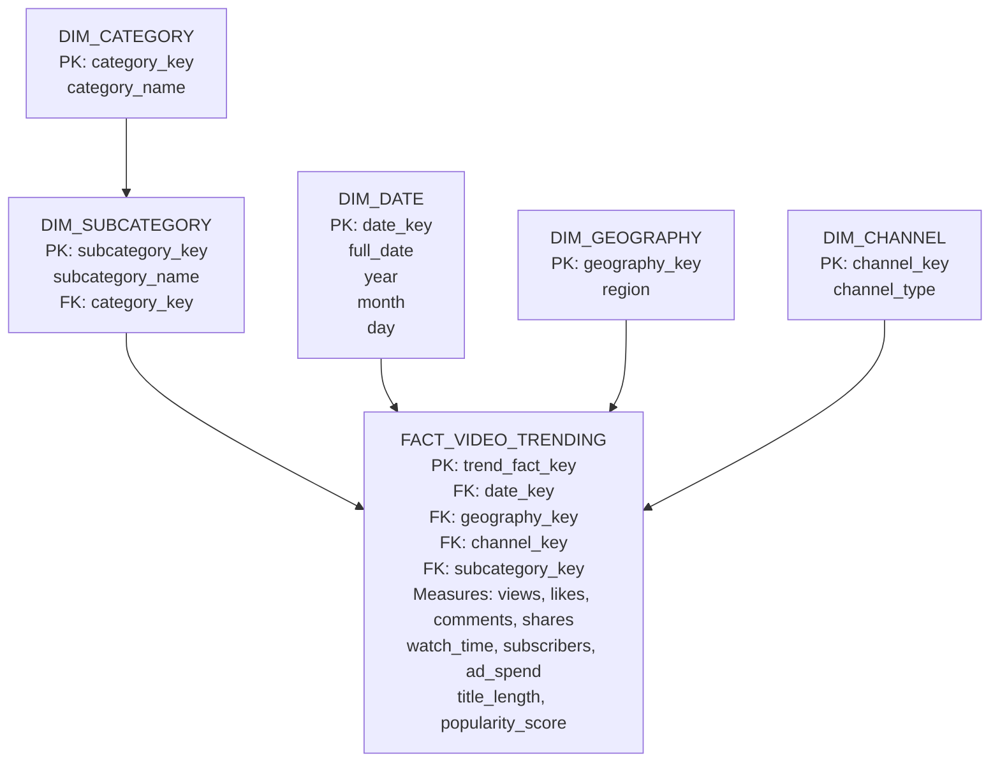

# Snowflake Schema – YouTube Trending Analytics

## Schema Diagram



## Snowflake Structure

The central fact table is `FACT_VIDEO_TRENDING`. It connects to the date, geography, channel, and subcategory dimensions.

The category hierarchy is normalized through:

`FACT_VIDEO_TRENDING → DIM_SUBCATEGORY → DIM_CATEGORY`

This normalized dimension hierarchy makes the model a **Snowflake Schema** rather than a simple Star Schema.

## Tables

| Table | Role | Key / Relationship |
|---|---|---|
| `FACT_VIDEO_TRENDING` | Fact table | Stores video performance measures |
| `DIM_DATE` | Dimension | `date_key` |
| `DIM_GEOGRAPHY` | Dimension | `geography_key` |
| `DIM_CHANNEL` | Dimension | `channel_key` |
| `DIM_SUBCATEGORY` | Dimension | `subcategory_key`, FK `category_key` |
| `DIM_CATEGORY` | Dimension | `category_key` |

## Relationships

- `FACT_VIDEO_TRENDING.date_key → DIM_DATE.date_key`
- `FACT_VIDEO_TRENDING.geography_key → DIM_GEOGRAPHY.geography_key`
- `FACT_VIDEO_TRENDING.channel_key → DIM_CHANNEL.channel_key`
- `FACT_VIDEO_TRENDING.subcategory_key → DIM_SUBCATEGORY.subcategory_key`
- `DIM_SUBCATEGORY.category_key → DIM_CATEGORY.category_key`

## Example Hierarchy

```text
Category
   └── Music
        ├── Pop
        └── Hip Hop

Category
   └── Gaming
        ├── Esports
        └── Walkthrough

Category
   └── Education
        ├── Technology
        └── Science
```

## Implementation

The executable Snowflake DDL is in [`../sql/01_warehouse_setup.sql`](../sql/01_warehouse_setup.sql).
